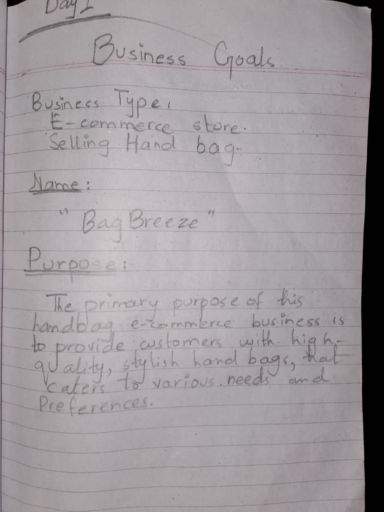
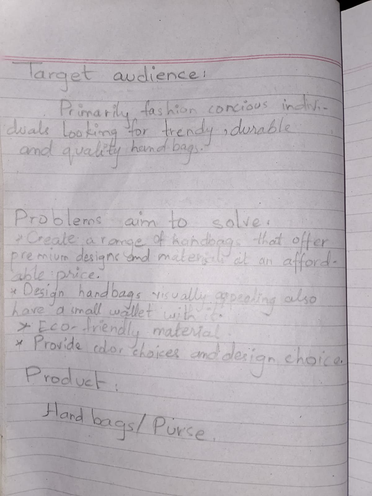
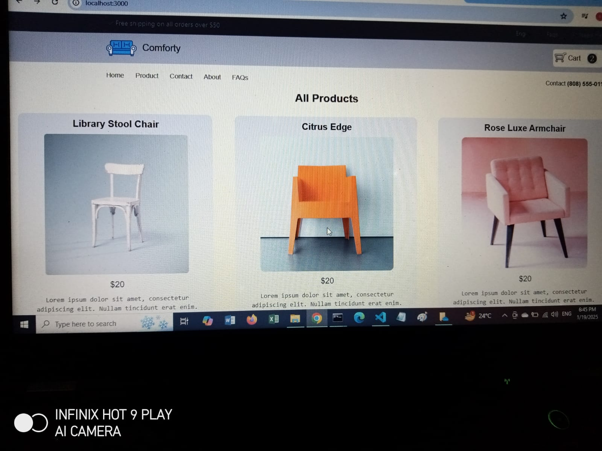
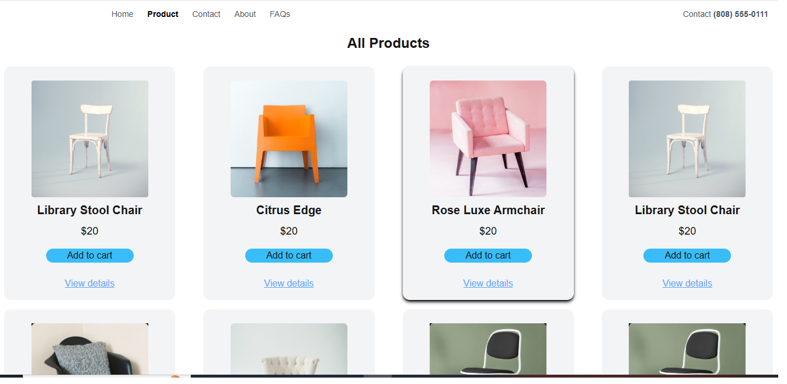
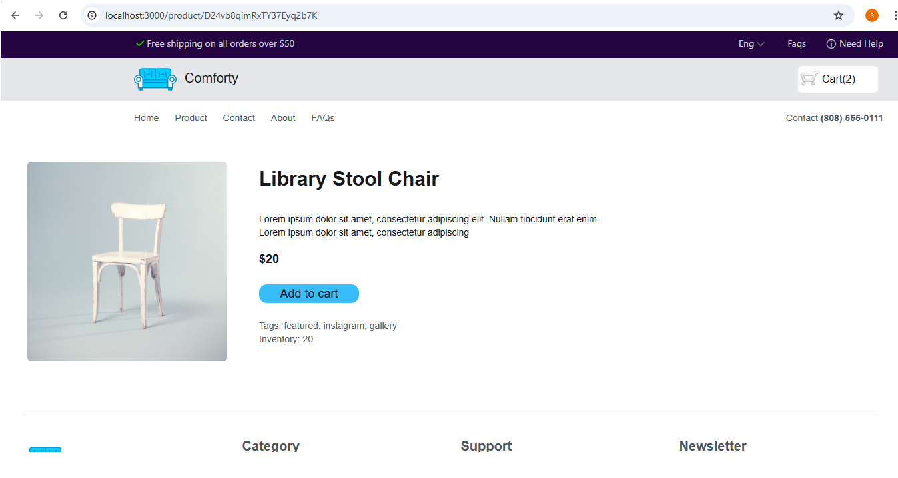
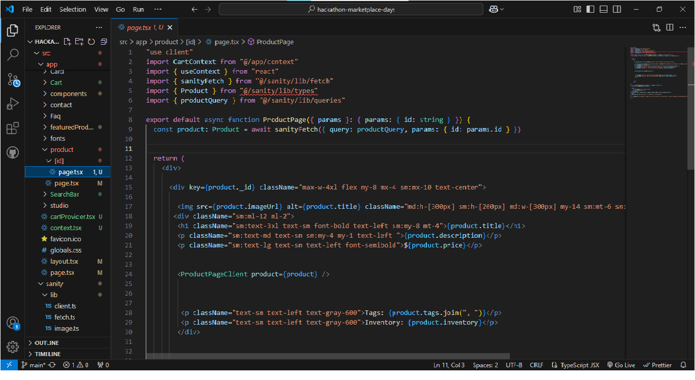
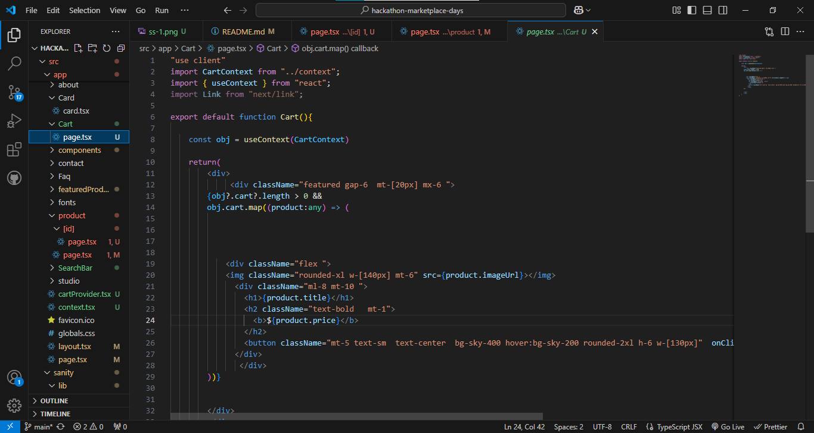

## Day1 Planning

.jpeg)
.jpeg)

## Day2 Technical reuirements
.jpeg)
.jpeg)
.jpeg)
.jpeg)
.jpeg)

## Day4
## Screenshot of Data displaying in Frontend after fetching it from Sanity!

## Product listing page with dynamic data

## Single product dynamic page 

## Code of dynamic Product detail page

## Cart page

##  View the Hackathon Report (PDF)
[📄 View the Hackathon Report (PDF)](docs/hackathon-report.pdf)